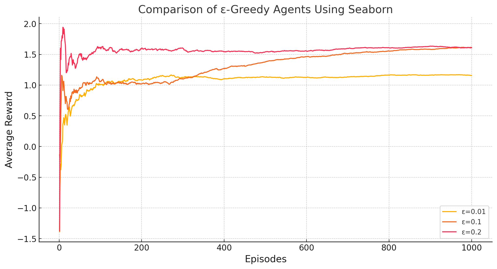
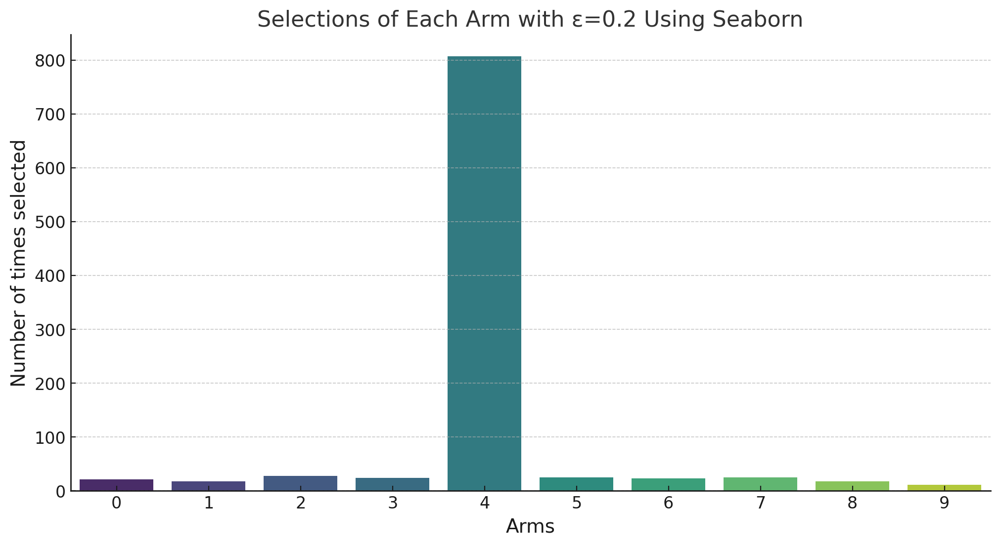

---

# 10-Arm Testbed Simulation 🎰

## Overview 📖

This project implements a simulation of the 10-arm testbed problem commonly used in reinforcement learning to demonstrate the ε-greedy algorithm. Different ε-values are tested to observe their impact on the agent's ability to balance exploration and exploitation.

## Files in the Repository 🗂️

- `main.py`: The main script to run simulations. It sets up the environment, initializes agents with different ε-values, and runs the simulations.
- `agent.py`: Defines the `Agent` class, which encapsulates the behavior of an ε-greedy agent.
- `visualization.py`: Contains functions to visualize the results of the simulations using Seaborn and Matplotlib for better aesthetic appeal.

## Setup & Installation 🛠️

Before running the simulation, make sure you have Python installed on your system. You will also need the following Python packages:
- NumPy
- Matplotlib
- Seaborn

You can install these packages using pip:

```bash
pip install numpy matplotlib seaborn
```

## Running the Simulation 🚀
To run the simulation, execute the `main.py` file. This can be done from the command line:

```bash
python main.py
```

## Results 📊

### Average Reward vs. Episodes

*This plot shows how the average reward received by the agents evolves over the episodes for different ε-values. From the visualization, we can observe the following:*
- **Higher ε-values**: Agents with higher ε-values (e.g., 0.2) show more initial exploration, which can lead to discovering more rewarding options early on, but may result in lower average rewards initially as they explore less optimal choices.
- **Lower ε-values**: Agents with lower ε-values (e.g., 0.01) tend to exploit their current knowledge more efficiently, leading to higher immediate returns, especially if they initially stumble upon higher-rewarding arms.

### Selections of Each Arm

*This plot displays how frequently each arm was chosen by the agents, indicating their exploration strategies. Key insights include:*
- **Balanced Exploration**: Agents with moderate ε-values (e.g., 0.1) often achieve a balance between exploration and exploitation, gradually focusing more on the better-performing arms as they learn from repeated interactions.
- **Preference Patterns**: The variation in selection across arms for higher ε-values suggests a more uniform exploration pattern, while lower ε-values indicate a rapid convergence to a few perceived best options.

## Contributing 🤝

Feel free to fork this project. Enjoy exploring reinforcement learning with this 10-arm testbed simulation! 🌟

## License 📄
This project is open-source and available under the MIT License.

---
