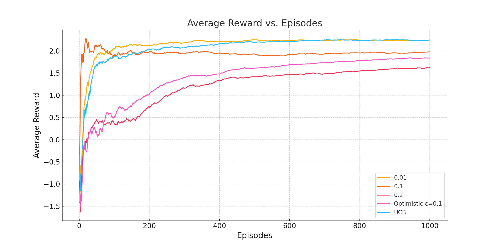
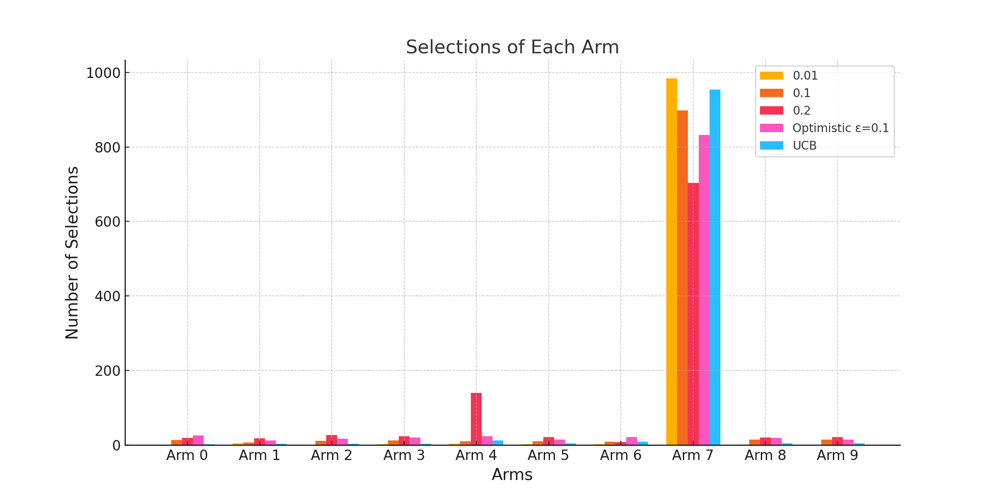
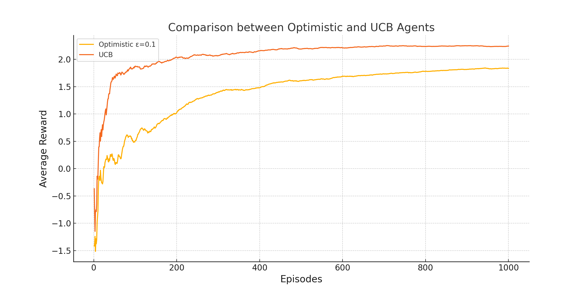

---

# 10-Arm Testbed Simulation 🎰

## Overview 📖

This project implements a simulation of the 10-arm testbed problem commonly used in reinforcement learning to demonstrate the ε-greedy algorithm. Different ε-values are tested to observe their impact on the agent's ability to balance exploration and exploitation.

## Files in the Repository 🗂️

- `main.py`: The main script to run simulations. It sets up the environment, initializes agents with different ε-values, and runs the simulations.
- `agent.py`: Defines the `Agent` class, which encapsulates the behavior of an ε-greedy agent.
- `visualization.py`: Contains functions to visualize the results of the simulations using Seaborn and Matplotlib for better aesthetic appeal.

## Setup & Installation 🛠️

Before running the simulation, make sure you have Python installed on your system. You will also need the following Python packages:
- NumPy
- Matplotlib
- Seaborn

You can install these packages using pip:

```bash
pip install numpy matplotlib seaborn
```

## Running the Simulation 🚀
To run the simulation, execute the `main.py` file. This can be done from the command line:

```bash
python main.py
```

## Visualizations 📊

### Average Reward vs. Episodes

This plot shows the average reward over episodes for different agents.



### Selections of Each Arm

This grouped bar chart visualizes the number of times each arm was selected by different agents.



### Comparison between Optimistic and UCB Agents

This plot compares the average reward over episodes for the optimistic initial values agent and the UCB agent.



## Inferences from Visualizations 📈

1. **Average Reward vs. Episodes**:
   - The UCB agent consistently achieves a higher average reward compared to ε-greedy agents.
   - The optimistic initial values agent starts strong but converges to similar performance as the ε = 0.1 agent.

2. **Selections of Each Arm**:
   - The UCB agent explores the arms more uniformly compared to other agents.
   - The ε = 0.01 agent tends to exploit more, showing a preference for a particular arm.

3. **Comparison between Optimistic and UCB Agents**:
   - The UCB agent outperforms the optimistic initial values agent in terms of average reward.
   - The optimistic agent starts with a higher initial reward but is eventually surpassed by the UCB agent.

## Contributing 🤝

Feel free to fork this project. Enjoy exploring reinforcement learning with this 10-arm testbed simulation! 🌟

## License 📄
This project is open-source and available under the MIT License.

---
